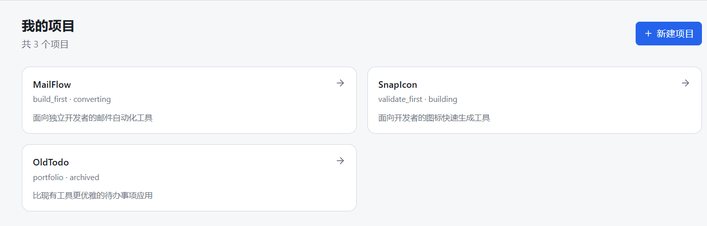
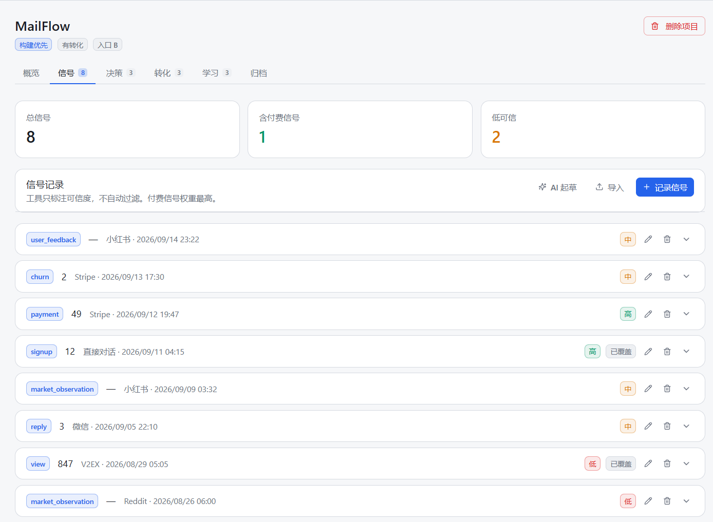
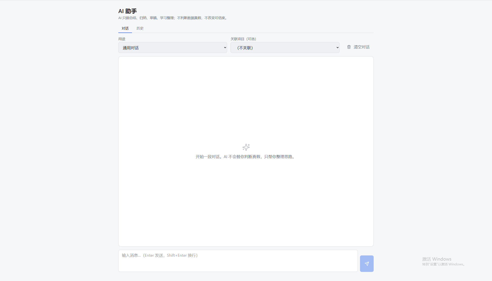
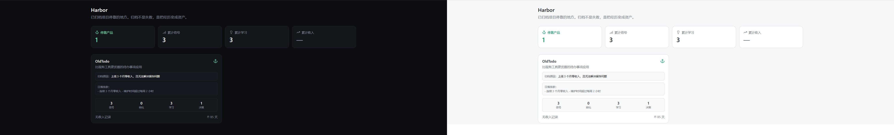

<div align="center">

# 📡 ShipSignal

**独立开发者的决策副驾**

从「我有个想法」到「这件事该不该继续」——每一步决定，都有据可查。

[⬇️ 下载 Windows 版](https://github.com/Boris-boomer/shipsignal/releases/latest) · [⭐ Star](https://github.com/Boris-boomer/shipsignal) · [🐛 反馈](https://github.com/Boris-boomer/shipsignal/issues)

[](https://opensource.org/licenses/MIT)
[](https://github.com/Boris-boomer/shipsignal/releases)
[](https://github.com/Boris-boomer/shipsignal/stargazers)
[](https://github.com/Boris-boomer/shipsignal/releases)



</div>

---

## 📥 下载安装

<div align="center">

### ⬇️ [**点此下载最新版**](https://github.com/Boris-boomer/shipsignal/releases/latest)

[](https://github.com/Boris-boomer/shipsignal/releases/latest)

**Windows 用户下载 `ShipSignal_0.1.0_x64-setup.exe`**（约 5MB，双击安装即可）

</div>

---

## 🤔 你是不是也这样？

- 🤯 想法一堆，落地一个。过俩月回头看，**说不清为什么放弃，也说不清为什么坚持**
- 🗂️ 数据散落各处：小红书评论、社区回复、微信聊天、Stripe 后台
- 🎲 每次做决定，**凭感觉**。做完了也没留下什么可以复用的东西
- 📓 用了 Notion、Excel、飞书，记了一堆，**从没回看过第二次**

> **问题不在你不够努力，在于——没有工具帮你把「决策」这件事结构化沉淀下来。**

---

## 🎯 ShipSignal 是干什么的？

一个**本地优先**的桌面工具。把你从产品验证到转化的每个关键判断，变成 **可追溯、可复用、可复利** 的资产。

不是又一个笔记软件，也不是又一个看板。它只做一件事：

> ### ✨ 让每一个决定，都有据可查 ✨

---

## 📸 截图

### 主界面 · 多个项目一眼看清


### 信号面板 · 付费信号权重最高



### AI 助手 · 只起草，不替你决定



### 深色 / 浅色 · 跟随你



---

## 🚪 三个入口，匹配你的当前状态

| 🚪 入口 | 👤 适合 | 🎁 你会得到 |
| :---: | :--- | :--- |
| 🅰️ **A** | 有个想法，还没动手 | 痛点 → 验证结果 → 产品定义 |
| 🅱️ **B** | 有产品，转化难 | 产品状态 → 渠道信号 → 变现匹配 |
| 🆑 **C** | 多个产品，想系统管理 | 分配原则 → 日落条款 → 定期 review |

---

## ✨ 核心能力

| | | |
| :---: | :--- | :--- |
| 📡 | **信号记录** | 每条信号都带「来源可验证性」和「付费标记」。付费信号权重远高于非付费信号。 |
| 📋 | **决策日志** | 记录你基于哪些信号做了什么决定。后续可以验证对错。 |
| 💰 | **转化追踪** | 每笔付费都值得记录。多币种，订阅 / 一次性，一目了然。 |
| 💡 | **学习信号** | 归档项目时，强制提取至少 3 条可迁移的认知。 |
| ⚓ | **Harbor 停靠港** | 已归档项目不是失败，是资产。 |
| 🤖 | **AI 助手** | 支持 OpenAI 兼容的所有服务。AI 不参与任何可信度判断。 |

---

## 🛡️ 三条铁律

### 🎯 1. 工具只让决策可追溯，不替你做决定

AI 只做归纳、总结、起草。**不判断数据真假，不修改任何评分，不自动归档。**

### 🔒 2. 数据是你的，永远在你自己机器上

所有内容存在本地 SQLite。不上传、不注册、不联网（除非你主动调 AI）。API Key 只存本地。

### 💎 3. 付费信号是唯一诚实的信号

点赞、浏览量、注册数都会骗人。**付费不会。** 所以我们把付费信号权重拉到最高。

---

## 🎁 一些细节

| | |
| :---: | :--- |
| 🌐 | **中英文界面** — 一键切换，全 UI 覆盖 |
| 🎨 | **深色 / 浅色主题** — 跟随系统或手动切换 |
| 🔤 | **字体 7 档可调** — 从紧凑到巨大，适合各种视力 |
| 🖥️ | **系统托盘** — 关闭确认 + 托盘常驻 |
| 🔍 | **全局搜索** — Ctrl+K 跨项目搜信号、决策、学习、转化 |
| 📥 | **批量导入** — CSV / JSON 一键导入，自动去重 |
| 📤 | **数据导出** — Markdown 全量导出，JSON 完整备份 |

---

## 🤖 关于 AI

AI 是**可选的**。不配 API Key，其他功能全部照常使用。

配了之后，AI 会在这些场景帮你：

- 📡 从一段用户反馈里提取结构化信号
- 📋 根据现有信号起草产品定义
- 💡 总结一个项目的学习信号
- 📢 起草分发文案

**AI 不参与任何可信度判断。** 所有 AI 生成的内容，你确认后才入库。

---

## ❓ FAQ

**数据存在哪？**
本地 SQLite，不上传、不注册。文件在你自己的机器上。

**要联网吗？**
不联网也能用。只有你主动调 AI 时才联网。

**收费吗？**
免费，开源 MIT，打赏制。没有 Pro 版，没有付费墙，没有订阅。

**AI Key 怎么配？**
设置页填 OpenAI 兼容服务的 Key（内置 OpenAI / 智谱 / DeepSeek / Kimi / 通义 预设），只存本地。

**为什么付费信号权重最高？**
点赞、浏览量、注册数都会骗人。付费不会。

**支持 macOS / Linux 吗？**
代码支持，当前只发布了 Windows 安装包。其他平台可源码编译。

---

## 🚀 快速开始（开发者）

普通用户请直接去 [Releases](https://github.com/Boris-boomer/shipsignal/releases/latest) 下载安装包。以下为源码开发：

```bash
# 安装依赖
pnpm install

# 开发模式
pnpm tauri dev

# 打包发布
pnpm tauri build
```

**系统要求**：Windows 10+ / macOS 10.15+ / Linux
**开发环境**：Node 20+ 和 Rust stable

---

## 🔧 技术栈

[](https://tauri.app)
[](https://react.dev)
[](https://www.typescriptlang.org)
[](https://www.rust-lang.org)
[](https://vitejs.dev)
[](https://tailwindcss.com)
[](https://sqlite.org)

| 🧱 层 | ⚙️ 技术 |
| :--- | :--- |
| 桌面 | **Tauri 2.0**（Rust + WebView） |
| 前端 | **React 19** + TypeScript + Vite 6 + Tailwind CSS 4 |
| 状态 | **Zustand 5** |
| 存储 | **SQLite** (tauri-plugin-sql) |
| 后端 | **Rust** |

**📦 安装包体积** ~5MB · **⚡ 冷启动** 小于 1 秒

---

## ☕ 打赏

如果 ShipSignal 帮到了你，欢迎在**设置页 → 关于**扫码请作者喝杯咖啡。

> 💬 这杯咖啡不会让我变富，但会让我开心一整天。

完全自愿，**不影响任何功能**。没有 Pro 版，没有付费墙，没有订阅。

---

## 💬 反馈

- 🐛 **GitHub Issues**：https://github.com/Boris-boomer/shipsignal/issues
- 📧 **邮箱**：3090287415@qq.com

Bug、建议、想法，都欢迎。

---

## 📄 License

MIT — 随便用，随便改，随便商用。只求你用得上。

---

<div align="center">

**⭐ 如果觉得有用，请点个 Star ⭐**

Made with ❤️ by [Boris-boomer](https://github.com/Boris-boomer)

</div>